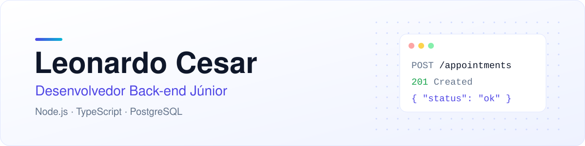

<picture>
  <source media="(prefers-color-scheme: dark)" srcset="./assets/header-dark.svg">
  
</picture>

<p align="center">
  <a href="https://github.com/Leonardo-backend">
    
  </a>
</p>

<p align="center">
  <a href="https://www.linkedin.com/in/leonardo-cesar-da-silva-981188262/"></a>
  
  
</p>

<br>

## Sobre mim

Desenvolvedor back-end júnior. Gosto de transformar regras de negócio em APIs bem organizadas, com validação, tratamento de erros e testes automatizados.

```ts
const leonardo = {
  cargo: "Desenvolvedor Back-end Júnior",
  foco: ["APIs REST", "Regras de negócio", "Testes automatizados"],
  usoEmProjetos: ["JavaScript", "Node.js", "Express", "PostgreSQL", "React", "Vitest"],
  estudandoAgora: ["TypeScript", "Fastify", "Prisma"],
  procurando: "Vaga remota como desenvolvedor júnior",
};
```

## Tecnologias

<p>
  <picture>
    <source media="(prefers-color-scheme: dark)" srcset="https://skillicons.dev/icons?i=js%2Cts%2Cnodejs%2Cexpress%2Cpostgres%2Cprisma%2Creact%2Cvitest%2Cgit%2Cgithub&theme=dark&perline=10">
    
  </picture>
</p>

## Projetos

<table>
  <tr>
    <td width="50%" valign="top">
      <h3><a href="https://github.com/Leonardo-backend/steamtwo">SteamTwo</a></h3>
      <p>Plataforma full-stack de rankings e métricas de jogos. Projeto em equipe onde fiz o endpoint de métricas com seed do banco, o comparador de jogos e a suíte de testes.</p>
      <p>
        
        
        
        
      </p>
    </td>
    <td width="50%" valign="top">
      <h3>barber-api</h3>
      <p>API de agendamentos para barbearia: horários livres, proteção contra agendamento duplicado direto no banco, login com perfis e documentação Swagger.</p>
      <p>
        
        
        
        
      </p>
    </td>
  </tr>
</table>

## Contato

Estou aberto a conversar sobre vagas e projetos. O jeito mais rápido de falar comigo é pelo [LinkedIn](https://www.linkedin.com/in/leonardo-cesar-da-silva-981188262/).
