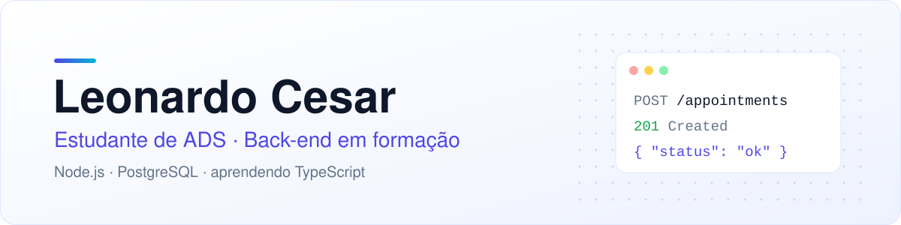

<picture>
  <source media="(prefers-color-scheme: dark)" srcset="./assets/header-dark.svg">
  
</picture>

<p align="center">
  <a href="https://github.com/Leonardo-backend">
    
  </a>
</p>

<p align="center">
  <a href="https://www.linkedin.com/in/leonardo-cesar-da-silva-981188262/"></a>
  
  
</p>

<br>

## Sobre mim

Estudo Análise e Desenvolvimento de Sistemas na FATEC Ourinhos e trabalho com suporte a sistemas ERP, onde lido com PostgreSQL e com clientes todos os dias. Estou no começo da carreira em desenvolvimento e aprendo construindo projetos: cada repositório aqui é um passo desse caminho.

Também uso IA generativa como apoio para estudar e programar. Escrevo os prompts, leio o código gerado, testo e só mantenho o que eu entendo.

```ts
const leonardo = {
  hoje: "Suporte a sistemas ERP + estudante de ADS",
  usoNoTrabalho: ["PostgreSQL", "SQL", "Linux", "Git"],
  jaUseiEmProjetos: ["JavaScript", "Node.js", "Express", "React", "Vitest"],
  estudandoAgora: ["TypeScript", "Fastify", "Prisma"],
  procurando: "Primeira vaga remota como desenvolvedor júnior",
};
```

## Tecnologias

**Uso no dia a dia**

<p>
  <picture>
    <source media="(prefers-color-scheme: dark)" srcset="https://skillicons.dev/icons?i=postgres%2Clinux%2Cgit%2Cgithub&theme=dark">
    
  </picture>
</p>

**Já usei em projetos e sigo praticando**

<p>
  <picture>
    <source media="(prefers-color-scheme: dark)" srcset="https://skillicons.dev/icons?i=js%2Cnodejs%2Cexpress%2Creact%2Cvitest&theme=dark">
    
  </picture>
</p>

**Estudando agora**

<p>
  <picture>
    <source media="(prefers-color-scheme: dark)" srcset="https://skillicons.dev/icons?i=ts%2Cprisma&theme=dark">
    
  </picture>
  
</p>

## Projetos

<table>
  <tr>
    <td width="50%" valign="top">
      <h3><a href="https://github.com/Leonardo-backend/steamtwo">SteamTwo</a></h3>
      <p>Projeto acadêmico em equipe: plataforma de rankings e métricas de jogos. Minha parte foi o endpoint de métricas com seed do banco, o comparador de jogos e a suíte de testes.</p>
      <p>
        
        
        
        
      </p>
    </td>
    <td width="50%" valign="top">
      <h3>barber-api</h3>
      <p>Projeto de estudo para aprender TypeScript, Fastify e Prisma: API de agendamentos para barbearia com horários livres, proteção contra agendamento duplicado, login com perfis e documentação Swagger.</p>
      <p>
        
        
        
        
      </p>
    </td>
  </tr>
</table>

## Contato

Estou aberto a conversar sobre vagas, projetos e estudos. O jeito mais rápido de falar comigo é pelo [LinkedIn](https://www.linkedin.com/in/leonardo-cesar-da-silva-981188262/).
